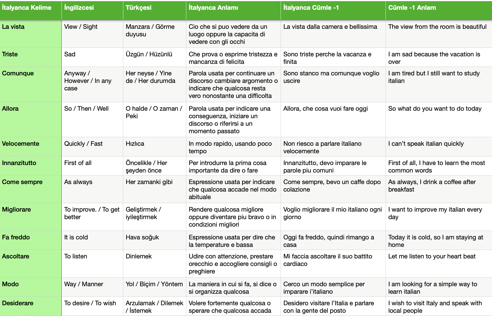
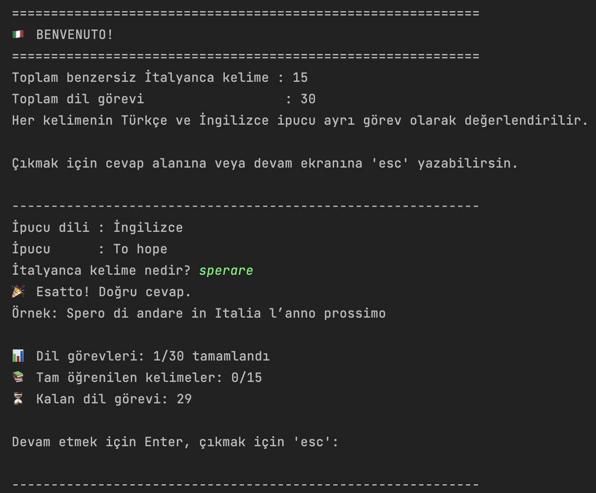
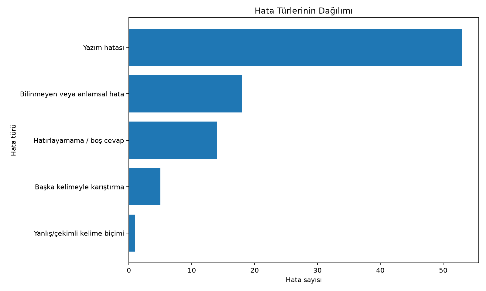
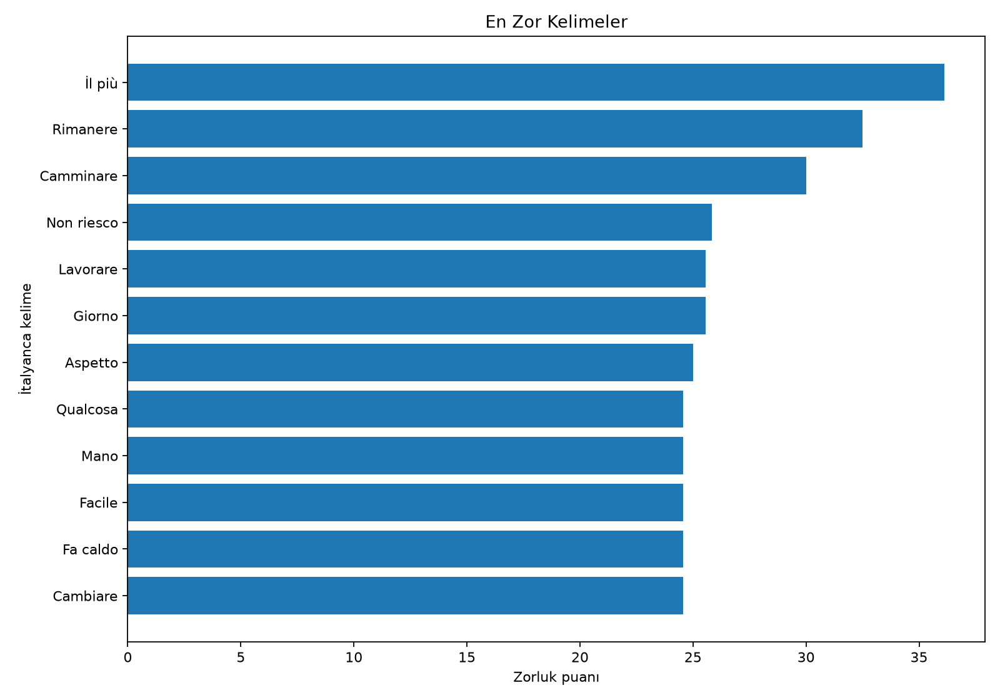

# 🇮🇹 İtalyanca Kelime Quiz ve Öğrenme Analiz Sistemi

 CSV dosyasında tuttuğum İtalyanca kelimeleri **aktif hatırlama yöntemiyle** çalışmak, yaptığım hataları nedenleryile kaydetmek ve zaman içindeki gelişimimi analiz etmek için geliştirdiğim terminal tabanlı Python projesi.

## Projenin çıkış noktası

Bana göre bir dili öğrenmenin en önemli amacı **konuşabilmektir**. Konuşabilmek için de en azından ilk süreçte gramer kurallarıyla zaman kaybetmektense; günlük hayatta söylemek istediğimiz şeyleri ifade edecek kelimelere sahip olmamız gerekir.

Bu nedenle kelime listemi rastgele sözlük maddelerinden oluşturmuyorum. İzlediğim videolarda (Easy Italian vb.), günlük konuşmalarda, seyahat sırasında veya kendi hayatımda kullanmaya ihtiyaç duyduğum kelime ve ifadeleri araştırıp CSV dosyama ekliyorum.

Bu proje de o listeyi pasif biçimde tekrar okumak yerine, anlamdan kelimeyi bulmaya çalıştığım bir **aktif hatırlama sistemi** hâline getiriyor.

## Uygulama Ekran görüntüleri

### Kelime veri seti



### Terminal tabanlı quiz



### Öğrenme analizleri





---

## Sistem nasıl çalışıyor?

### 1. Kelimeleri CSV dosyasında topluyorum
Quiz için gerekli temel sütunlar:

| Sütun | Açıklama |
|---|---|
| `İtalyanca Kelime` | Bulmaya çalışılan hedef kelime veya ifade |
| `Türkçesi` | Türkçe ipucu |
| `İngilizcesi` | İngilizce ipucu |
| `İtalyanca Cümle -1` | Cevaptan sonra gösterilen örnek cümle |

CSV dosyasında bunlara ek olarak İtalyanca açıklama (Bana göre her ne kadar en başta italyanca sözlükteki anlamı çok anlamasakta bunun bize faydası var, görmeye alışıyoruz), cümlenin çevirisi ve ekstra cümle sütunları bulunuyor

### 2. Quiz terminalde çalışıyor

Her kelimenin Türkçe ve İngilizce karşılığı ayrı bir görev olarak değerlendirilir.

Örneğin `sperare` kelimesi için:

- Türkçe ipucu: `Umut etmek`
- İngilizce ipucu: `To hope`

iki ayrı soru oluşturulur.

Quiz sırasında:

- Sorular rastgele sırayla gelir.
- Büyük/küçük harf ve gereksiz boşluklar cevap kontrolünü etkilemez.
- Doğru cevaplanan görev mevcut oturumun soru havuzundan çıkarılır.
- Yanlış cevaplanan görev havuzda kalır ve daha sonra tekrar sorulur.
- Yanlış yapılan soru mümkün olduğunca hemen arka arkaya getirilmez.
- Cevaptan sonra varsa İtalyanca örnek cümle gösterilir.
- `esc` yazarak oturum erken sonlandırılabilir.
- İstenirse yalnızca belirli CSV satırları çalışılabilir. (Bunu özellikle günde 10-15 kelime öğrendikten sonra uyguluyorum, sadece son öğrendiğim kelimleri dahil etmek için)

Bir kelimenin hem Türkçe hem İngilizce görevi doğru cevaplandığında kelime o oturum için **tam öğrenilmiş** kabul edilir.

### 3. Her cevap kaydediliyor

Her quiz oturumunda aşağıdaki bilgiler saklanır:

- Oturum kimliği ve cevap zamanı
- Sorulan İtalyanca kelime
- İpucu dili ve gösterilen ipucu
- Kullanıcının cevabı
- Doğru veya yanlış sonucu
- Görevin kaçıncı denemede cevaplandığı
- İlk denemede doğru olup olmadığı
- Hata türü
- Kelime benzerlik skoru
- Karıştırılan başka bir kelime varsa onun adı
- Örnek cümle

Oturum sonunda üç tür kayıt oluşabilir:

```text
sessions/*_attempts.csv
sessions/*_summary.csv
failed/*_failed.csv
```

`attempts` dosyası bütün cevapları, `summary` dosyası oturum özetini, `failed` dosyası ise yanlış yapılan kelimelerin ayrıntılarını saklar.

## Otomatik hata sınıflandırması

Yanlış cevaplar yalnızca “yanlış” olarak bırakılmaz. Cevabın yapısına göre aşağıdaki kategorilerden birine atanır:

| Hata türü | Açıklama |
|---|---|
| `spelling_error` | Doğru kelimeye yüksek oranda benzeyen yazım hatası |
| `confused_with_another_word` | CSV içindeki başka bir İtalyanca kelimeyi yazma |
| `wrong_word_form` | Kelimenin mastarı yerine çekimli veya farklı biçimini yazma |
| `no_recall` | Boş cevap verme veya kelimeyi hatırlayamama |
| `unknown_or_semantic_error` | Alakasız cevap ya da anlamı yanlış hatırlama |

Yazım benzerliği için Python’ın `SequenceMatcher` aracı kullanılır. Ayrıca bazı düzensiz fiil çekimleri `WORD_FORMS` sözlüğüyle, düzenli `-are`, `-ere` ve `-ire` fiillerinin yaygın biçimleri ise yaklaşık kurallarla kontrol edilir.

## Analiz sistemi

`italian_quiz_analyzer.py`, geçmiş oturumlardaki `sessions` ve `failed` dosyalarını okuyarak toplu analiz üretir.

Oluşturulan temel çıktılar:

```text
analysis_reports/
├── analiz_raporu.md
├── en_zor_kelimeler.csv
├── en_sik_hata_turleri.csv
├── en_cok_karistirilan_kelime_ciftleri.csv
├── tarihsel_gelisim.csv
├── tarihsel_gelisim_gunluk.csv
├── tum_denemeler_siniflandirilmis.csv
├── en_zor_kelimeler.png
├── hata_turleri.png
└── tarihsel_gelisim.png
```

`analysis_reports/` klasörü analiz sistemi çalıştırıldığında lokal olarak oluşturulur. Bu klasördeki kişisel çalışma verileri ve üretilen raporlar Git tarafından takip edilmez.

---

### `analiz_raporu.md` neden önemli?

Bu dosya ham CSV tablolarını tek başına bırakmak yerine, öğrenme sürecini okunabilir bir Markdown raporuna dönüştürür.

Raporda şu başlıklar yer alır:

- Genel öğrenme özeti
- En zor kelimeler
- En sık görülen hata türleri
- En çok karıştırılan kelime çiftleri
- Oturum bazlı tarihsel gelişim
- İlk ve son oturum karşılaştırması
- Kelime bazlı çalışma önerileri

Bu sayede analiz sonuçları doğrudan GitHub üzerinden de okunabilir.

---

### Zorluk puanı

Her kelime için 0–100 arasında bir zorluk puanı hesaplanır. Puan şu unsurları birlikte değerlendirir:

- Yanlış cevap oranı
- Hatırlayamama oranı
- Bilinmeyen veya anlamsal hata oranı
- Başka kelimeyle karıştırma oranı
- Yazım hatası oranı
- Tekrar denemesi oranı

Puan yükseldikçe kelimenin sonraki çalışmalarda daha yüksek öncelik alması gerekir.

---

## Supabase kelime senkronizasyonu

CSV dosyası kelime çalışmalarım için ana veri kaynağı olmaya devam eder.

Yeni kelimeler `data/Italyanca_Kelimeler.csv` dosyasına eklendikten sonra:

```bash
python sync_words.py
```

komutuyla kelime listesi Supabase üzerindeki `words` tablosuyla senkronize edilir.

Senkronizasyon scripti:

- CSV ve veritabanındaki kelime sayılarını karşılaştırır.
- Yalnızca CSV'ye sonradan eklenen yeni kelimeleri gönderir.
- `sequence_no` sırasını korur.
- Mevcut kayıtların sırasının değiştirilmesini kontrol eder.
- Veritabanı zaten güncelse herhangi bir kayıt eklemez.
- Aynı senkronizasyonun tekrar çalıştırılması duplicate kelime oluşturmaz.

Örneğin CSV ve veritabanı zaten aynı durumdaysa:

```text
🇮🇹 Italian Vocabulary Sync
──────────────────────────────────────────

CSV words       : 347
Database words  : 347
New words       : 0

✅ Database is already up to date.
```

Bu yapı sayesinde kelime çalışma rutinimi değiştirmeden CSV dosyasını kullanmaya devam ederken, aynı kelime verilerini diğer uygulamalarda kullanmak üzere veritabanında da güncel tutabiliyorum.


## Planlanan geliştirmeler

- Zor kelimeleri daha sık soran akıllı tekrar sistemi
- Spaced repetition desteği  (yeni öğrenilen bilgileri unutma eğrisine göre giderek artan zaman aralıklarıyla (örneğin 1 gün, 3 gün, 1 hafta, 1 ay sonra) yeniden gözden geçirme yöntemidir)
- Streamlit tabanlı analiz paneli
- Telaffuz desteği
- Daha kapsamlı İtalyanca fiil çekimi analizi

---

## Kullanım

### Quiz

```bash
python src/quiz.py
```

### Analiz

```bash
python src/italian_quiz_analyzer.py
```

### Yeni kelimeleri Supabase'e gönderme

CSV dosyasına yeni kelimeleri ekledikten sonra:

```bash
python sync_words.py
```

---
## Not

Bu proje kişisel İtalyanca öğrenme sürecimden doğmuştur. Kelime veri setimi kendi çalışma yöntemime göre oluşturmaya devam ediyorum. Projeyi kendi listenizle kullanmak için aynı sütun yapısına sahip bir CSV dosyası oluşturmanız yeterlidir.


- *Melih Şişkular*